```mermaid
flowchart LR
    %% Modern Colorful Theme
    classDef repo fill:#E1F5FE,stroke:#0288D1,stroke-width:2px,color:#01579B,rx:10,ry:10
    classDef actions fill:#F3E5F5,stroke:#8E24AA,stroke-width:2px,color:#4A148C,rx:10,ry:10
    classDef script fill:#FFF3E0,stroke:#F57C00,stroke-width:2px,color:#E65100,rx:5,ry:5
    classDef tracking fill:#E8F5E9,stroke:#388E3C,stroke-width:2px,color:#1B5E20,rx:10,ry:10
    classDef deploy fill:#FFEBEE,stroke:#D32F2F,stroke-width:2px,color:#B71C1C,rx:10,ry:10
    classDef enduser fill:#E0F7FA,stroke:#0097A7,stroke-width:2px,color:#006064,rx:20,ry:20

    %% Nodes
    Repo[(GitHub Repository<br>Raw Data)]:::repo
    
    subgraph Pipeline [GitHub Actions CI/CD]
        direction TB
        Job1([1. Register Data<br>data_register.py]):::script
        Job2([2. Prep & Split<br>prep.py]):::script
        Job3([3. Train XGBoost<br>train.py]):::script
        
        Job1 -->|Validates Schema| Job2
        Job2 -->|Xtrain, ytrain| Job3
    end

    MLflow[(MLflow Server<br>Tracks Metrics)]:::tracking
    Model([best_model.pkl]):::repo
    
    Streamlit([Streamlit Cloud<br>Premium Web UI]):::deploy
    User((Business User<br>Sales Team)):::enduser

    %% Routing
    Repo -->|Push to Main| Pipeline
    Job3 -.->|Logs params/scores| MLflow
    Job3 -->|Git Auto-Commit| Model
    Model -->|Auto Deploys| Streamlit
    Streamlit <-->|Gets Predictions| User
```

<div align="center">
  
# Wellness Tourism Package Predictor (End-to-End MLOps Pipeline)

[](#)
[](#)
[](#)
[](#)
[](#)
[](#)

*An end-to-end Machine Learning Operations (MLOps) pipeline that predicts whether a customer will purchase a Wellness Tourism Package, featuring automated CI/CD and a premium Streamlit web application.*

[**Explore the Live App**](https://end-to-end-mlops-pipeline-for-tourism-purchase-prediction.streamlit.app/) <!-- Update with your actual Streamlit link -->

</div>

---

## Business Context

**"Visit with Us"**, a leading travel company, is revolutionizing the tourism industry by introducing a new "Wellness Tourism Package". However, they face challenges in targeting the right customers efficiently. Manual identification is inconsistent, time-consuming, and prone to errors, leading to suboptimal campaign performance and wasted marketing spend.

**The Solution:** A scalable, automated Machine Learning system that predicts customer purchase likelihood based on demographics, travel profiles, and historical interaction data. By deploying this system via a continuous CI/CD MLOps pipeline, the company can target high-potential leads efficiently and dynamically update their model as new data arrives.

---

## Project Architecture & Pipeline Flow

This project implements a complete **MLOps lifecycle** via GitHub Actions:

1. **Data Registration & Validation:** Ensures data integrity by strictly checking the schema (20 expected columns) before processing.
2. **Data Preparation:** Cleans the data, drops non-predictive features, and performs a **stratified 80/20 train/test split** to maintain the target class distribution.
3. **Model Training & Tuning:** Builds a full `scikit-learn` Pipeline (imputation + scaling/encoding + `XGBoost`). Tunes 72 hyperparameter combinations via `GridSearchCV` while optimizing for the **F1-Score**.
4. **Experiment Tracking:** Logs all hyperparameter configurations and test metrics (Accuracy, Precision, Recall, F1, ROC-AUC) using **MLflow**.
5. **Continuous Deployment (CI/CD):** Automatically commits the best trained model (`best_model.pkl`) back to the repository, which triggers the **Streamlit Community Cloud** to update the live web application.

---




---

## Key Features

- **End-to-End Automation:** Zero-touch pipeline triggered automatically on every push to the `main` branch.
- **Premium User Interface:** A highly polished, interactive Streamlit app featuring custom CSS gradients, hover animations, and confidence progress bars.
- **GPU Acceleration Support:** Auto-detects NVIDIA GPUs (e.g., in Google Colab) to accelerate `XGBoost` training using `tree_method='hist', device='cuda'`, falling back to CPU for GitHub Actions.
- **Robust Preprocessing:** Handled entirely within a `ColumnTransformer` Pipeline, meaning the final deployed model only requires raw customer inputs (no separate scaling/encoding logic needed in the app).
- **Imbalanced Data Handling:** Employs stratified splitting and optimizes for F1-score rather than accuracy to accurately capture the minority class (~19% purchase rate).

---

## Technology Stack

| Category | Tools & Libraries |
| :--- | :--- |
| **Language** | Python 3.11 |
| **Machine Learning** | `scikit-learn` (1.6.1), `XGBoost` (3.2.0) |
| **Data Manipulation** | `pandas`, `numpy` |
| **Experiment Tracking** | `MLflow` |
| **Model Serialization** | `joblib` |
| **Web Framework** | `Streamlit` (1.60.0) |
| **CI/CD** | GitHub Actions |

---

## Repository Structure

```text
📦 Project_End-to-End-MLOps-Pipeline...
 ┣ 📂 .github
 ┃ ┗ 📂 workflows
 ┃   ┗ 📜 pipeline.yml             # GitHub Actions CI/CD configuration
 ┣ 📂 tourism_project
 ┃ ┣ 📂 data
 ┃ ┃ ┗ 📜 tourism.csv              # Raw dataset
 ┃ ┣ 📂 deployment
 ┃ ┃ ┣ 📜 app.py                   # Premium Streamlit web application
 ┃ ┃ ┣ 📜 best_model.pkl           # Pickled sklearn pipeline (auto-generated)
 ┃ ┃ ┗ 📜 requirements.txt         # App-specific dependencies (Python 3.11, SKLearn 1.6.1)
 ┃ ┣ 📂 model_building
 ┃ ┃ ┣ 📜 data_register.py         # Data validation script
 ┃ ┃ ┣ 📜 prep.py                  # Cleaning & stratified splitting script
 ┃ ┃ ┗ 📜 train.py                 # Pipeline, GridSearchCV, MLflow tracking script
 ┃ ┗ 📜 requirements.txt           # Pipeline dependencies
 ┗ 📜 README.md
```

---

## Running Locally

To run this pipeline and Streamlit app on your local machine:

### 1. Clone the repository
```bash
git clone https://github.com/Ashish1100/Project_End-to-End-MLOps-Pipeline-for-Wellness-Tourism-Purchase-Prediction.git
cd Project_End-to-End-MLOps-Pipeline-for-Wellness-Tourism-Purchase-Prediction
```

### 2. Create a virtual environment and install dependencies
```bash
python -m venv venv
source venv/bin/activate  # On Windows use: venv\Scripts\activate
pip install -r tourism_project/requirements.txt
```

### 3. Run the ML Pipeline manually (Optional)
```bash
python tourism_project/model_building/data_register.py
python tourism_project/model_building/prep.py
python tourism_project/model_building/train.py
```

### 4. Launch the Streamlit App
```bash
pip install -r tourism_project/deployment/requirements.txt
streamlit run tourism_project/deployment/app.py
```

---

## GitHub Actions CI/CD

This repository uses GitHub Actions for continuous integration. When you push to the `main` branch, the workflow (`.github/workflows/pipeline.yml`) executes:
1. `register-dataset`: Validates data schema.
2. `data-prep`: Cleans and splits data.
3. `model-training`: Trains XGBoost, tracks with MLflow, and auto-commits the resulting `best_model.pkl` to the repository with a `[skip ci]` flag.

Streamlit Community Cloud is connected to this repository and automatically redeploys whenever the `best_model.pkl` or `app.py` is updated.

---


---
<div align="center">
  <i>Developed with ❤️ by Ashish</i>
</div>
